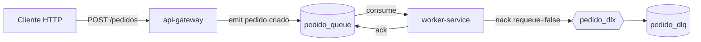

# RabbitMQ Study - API Gateway + Worker


Projeto de estudo com dois servicos NestJS:
- `api-gateway`: recebe pedidos via HTTP e publica mensagens no RabbitMQ.
- `worker-service`: consome mensagens da fila e processa os pedidos.

## Arquitetura

Fluxo principal:
1. Cliente envia `POST /pedidos` para o `api-gateway` (porta `3000`).
2. O `api-gateway` publica o evento `pedido.criado` na fila `pedido_queue`.
3. O `worker-service` consome a mensagem e faz `ack` em caso de sucesso.
4. Em erro, o worker faz `nack` sem reprocessar (`requeue = false`) e a mensagem vai para a DLQ.

Infra de filas:
- Fila principal: `pedido_queue`
- Dead Letter Exchange: `pedido_dlx`
- Dead Letter Queue: `pedido_dlq`

## Diagrama de Mensageria



## Pre-requisitos

- Node.js 20+ (recomendado)
- npm
- Docker + Docker Compose

## Como executar

### 1) Subir o RabbitMQ

Na raiz do projeto:

```bash
docker compose up -d
```

RabbitMQ Management:
- URL: `http://localhost:15672`
- Usuario: `admin`
- Senha: `admin`

### 2) Instalar dependencias

```bash
cd api-gateway && npm install
cd ../worker-service && npm install
cd ..
```

### 3) Iniciar o worker

Em um terminal:

```bash
cd worker-service
npm run start:dev
```

### 4) Iniciar a API

Em outro terminal:

```bash
cd api-gateway
npm run start:dev
```

## Como testar

### Pedido com sucesso

```bash
curl -X POST http://localhost:3000/pedidos \
  -H "Content-Type: application/json" \
  -d '{"id": 1, "valor": 1000}'
```

Resposta esperada da API:

```json
{"message":"Pedido enviado para processamento \ud83d\ude80"}
```

No log do worker, o pedido deve ser processado com sucesso.

### Pedido com erro (vai para DLQ)

No codigo atual, pedidos com `valor > 2000` geram erro proposital no worker.

```bash
curl -X POST http://localhost:3000/pedidos \
  -H "Content-Type: application/json" \
  -d '{"id": 2, "valor": 2500}'
```

Resultado esperado:
- Worker registra erro de processamento.
- Mensagem e enviada para `pedido_dlq`.

Voce pode validar isso no painel do RabbitMQ (`Queues`).

## Mensageria (resumo)

Mensageria desacopla quem produz eventos de quem processa:
- O `api-gateway` nao espera o processamento completo para responder ao cliente.
- O `worker-service` processa assincronamente, no seu proprio ritmo.
- Com `ack/nack`, o consumidor controla confirmacao de entrega.
- Com DLQ, mensagens com falha nao se perdem e podem ser inspecionadas/reprocessadas depois.

Esse padrao melhora resiliencia e escalabilidade, especialmente em fluxos de pedidos, notificacoes e integracoes entre servicos.

## Parar ambiente

Para parar o RabbitMQ:

```bash
docker compose down
```
